# What Context Layer Looks Like

This page shows the Context Layer playground in pictures. You do not need to install or run the application. Read this page from top to bottom to see the full product.

Context Layer reads your code and your documents. It builds a knowledge base from them. It keeps that knowledge base fresh. Humans read the knowledge base in a browser. AI agents read the same knowledge base through a tool interface.

> **Note about the data.** Every screenshot uses one example project. The project is a product catalog built from 7 Python microservices, a shared library, and a web interface. The system treats each part as a separate repository. This gives 9 code repositories and 5 document sources in one workspace. Your own numbers and names will be different.

---

## The Five Destinations

The product has five main pages. They follow the path that your knowledge takes.

| Step | Page | What it does |
|---|---|---|
| 1 | **Sources** | You add code, documents, and chat history here. |
| 2 | **Knowledge** | The system shows you what it learned. It holds the **Wiki** and **Intelligence**. |
| 3 | **Chatbot** | You ask questions. The answers point to the exact source. |
| 4 | **Generate** | You produce documents, slide decks, and audio. |
| 5 | **Library** | The system keeps every item that **Generate** made. |

A page stays locked until the step before it is complete. You must add one source. You must then build the first Wiki. The rest of the product unlocks after that.

---

## 1. Workspaces

A workspace holds all the sources that belong together. This is the first page that you see after you sign in.

Each card shows one workspace. The card shows the number of sources, the last activity, and the creation date. Click the card with the dotted border to make a new workspace. Use the search box when you have many workspaces.

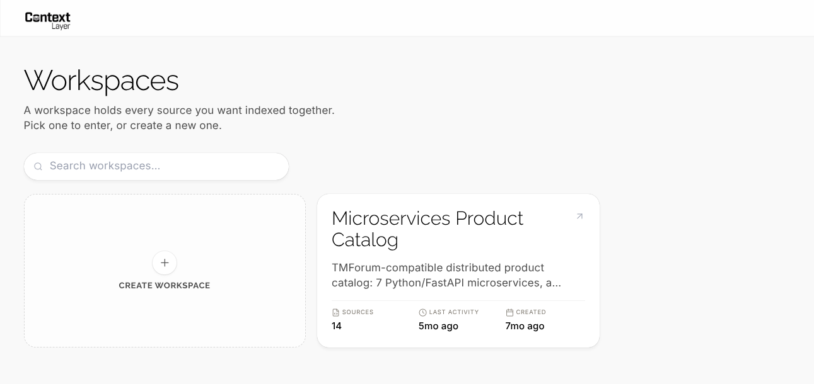

---

## 2. Sources

Sources is the input page. Everything else in the product comes from what you add here.

The system converts every file to a common text format. It then indexes the text. Two badges tell you the state of each source:

- **Indexed** — the system read the source and stored it.
- **Synced** — the Wiki agrees with the current state of the source.

The line **Last sync with knowledge** tells you when the Wiki last used this source. This is not the date of your last commit.

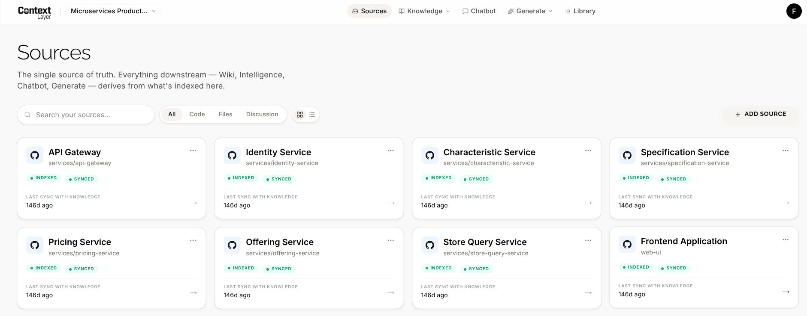

Sources are not only code. You can add specification documents, meeting notes, and design documents. The filter bar at the top selects the type. This picture shows the **Files** filter.

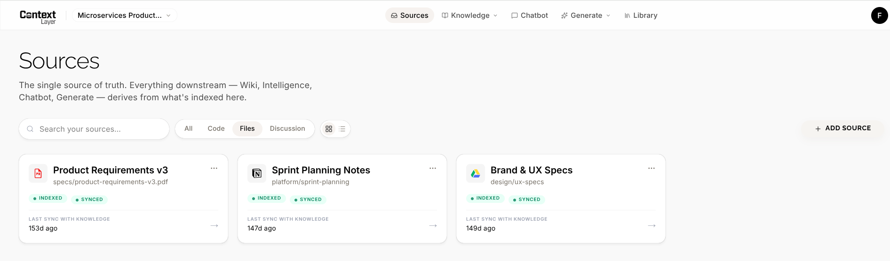

Click **Add Source** to connect a new system. The window groups the providers into three types: code, documents, and discussion. The system shows the two most common providers of each type first. Click **More options** to see the rest.

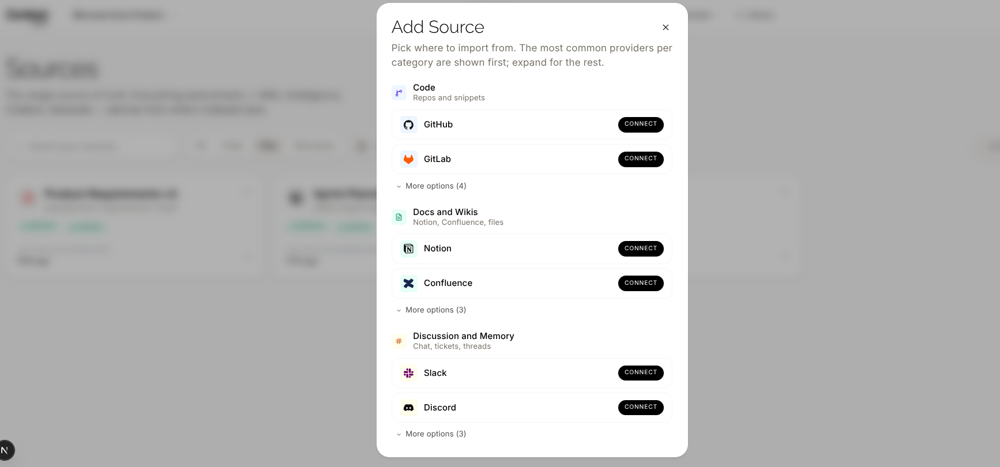

---

## 3. Knowledge — The Wiki

The Wiki is the written explanation of your system. It is prose, not a list of metrics. The system writes it and then keeps it current.

The Wiki has four tabs: **Status**, **View**, **Configure**, and **Logs**.

### 3.1 Status

Status answers one question: can you trust what you are about to read?

The four cards at the top show the coverage, the age, the connection state, and the gaps. **Coverage score** is the part of your tracked code that the Wiki includes. **Missing context** is the number of files that have no documentation yet.

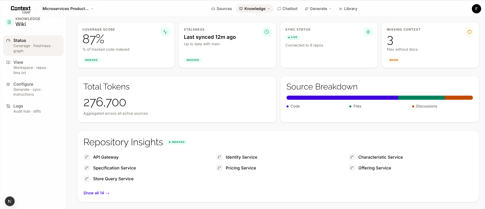

### 3.2 View

View is the reader. The tree on the left has two parts.

- **Workspace** — the explanation of the complete system. It covers all repositories together.
- **Repos** — one set of pages for each repository.

The workspace part is the important one. A tool that reads only one repository cannot write it. The page in this picture traces a transaction across four services.

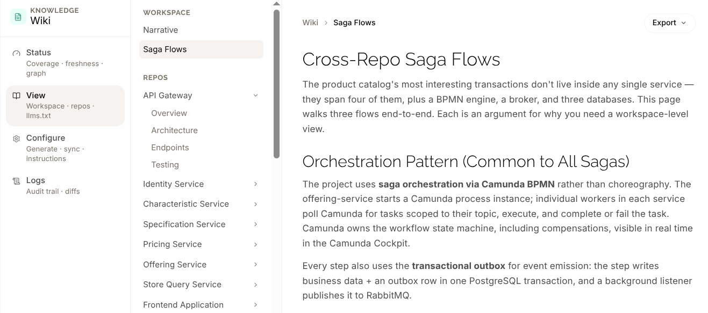

The pages contain diagrams, tables, and code. The system draws the diagrams from text, so they stay correct when the code changes.

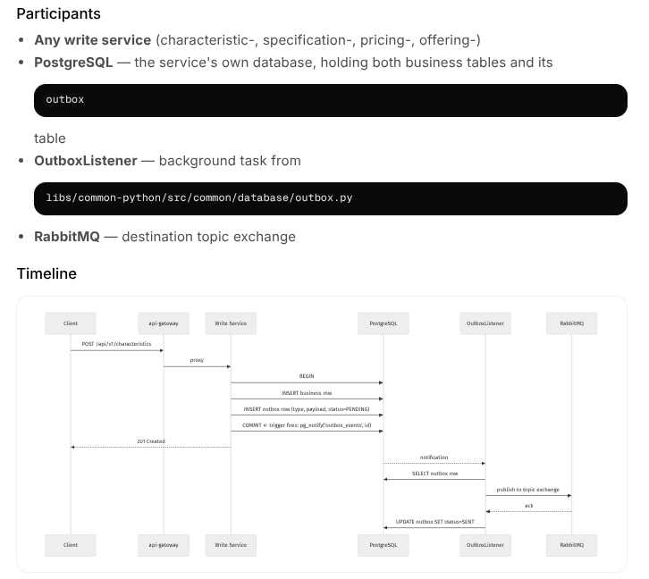

### 3.3 The Knowledge Graph

The knowledge graph shows the same system as a map. Each point is a service, a database, a queue, or an event. Each line is a relation. Use the search box to find one point.

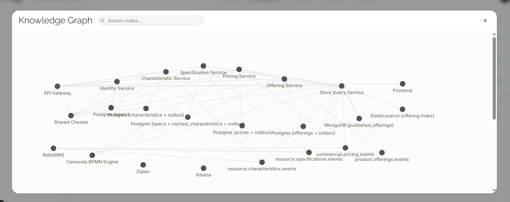

### 3.4 Configure

You start the first build of the Wiki yourself. You choose the sources and you write the instructions. After that, the system keeps the Wiki current for you.

This page holds the rules. **Sync strategy** sets how often the update runs. The example uses **Per PR merge**. Other options are per commit, hourly, daily, weekly, and manual.

The buttons give you manual control. You can force an update, rebuild the Wiki, change the sources, or delete the Wiki.

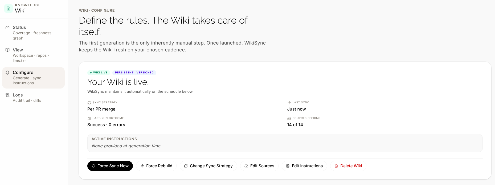

### 3.5 Logs

Logs is the history and the proof. The system stores the Wiki as text files under version control. Each update is therefore a commit.

Each row is one job. The row shows the trigger, the repository, the duration, and the number of changed lines. Open a row to see the steps that the agent ran. Click **View diff** to see the exact text that changed.

This page answers a hard question from an auditor: *what changed in our architecture documents last quarter, and why?*

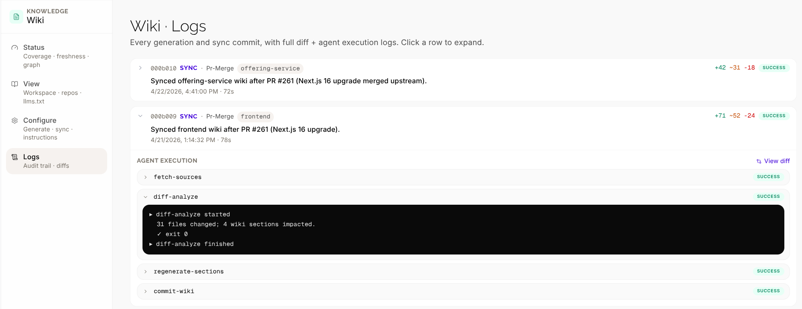

---

## 4. Knowledge — Intelligence

The Wiki explains your system in words. Intelligence measures it in numbers.

The page shows the health score, the security findings by severity, the test coverage, and the dependency risk. The bars at the right compare the repositories against each other.

The Wiki and Intelligence use the same knowledge base. They answer different questions. Read the Wiki to understand a design. Read Intelligence to find a risk.

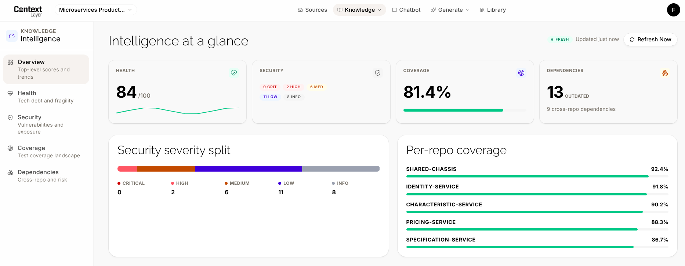

---

## 5. Chatbot

The Chatbot answers questions about your workspace. It uses the Wiki and the source code together.

Every answer has citations. The orange and blue labels in the text are the citations. They are not decoration. Each one points to a real file and a real line range.

The row named **Grounded in** limits the search. You can restrict the answer to the Wiki, to the code, or to your documents.

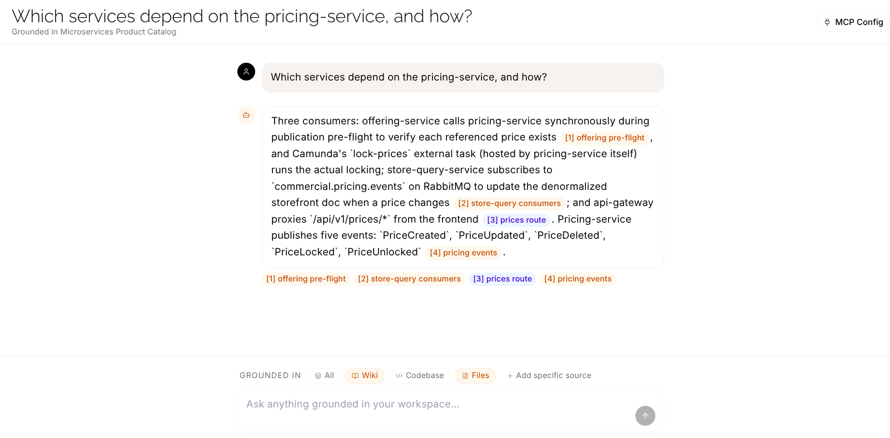

Click a citation to open the source panel. The panel names the exact file and the exact lines. The main answer stays visible on the left, so you do not lose your place.

> In this demo, the panel shows the file path and the line range. It does not show the file content, because the example data set does not include the source files.

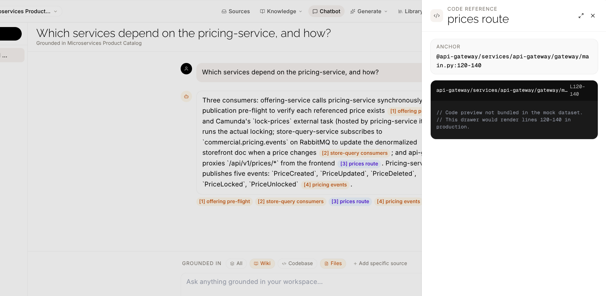

### The MCP Connection

This is the most important picture for a technical audience.

Your workspace is also available to AI coding tools. Click **MCP Config** to get the configuration. Add it to Claude Code, Claude Desktop, Cursor, or any other client that speaks the same protocol.

The connection gives the external tool three commands:

- `get_wiki_content` — read the Wiki.
- `get_code_intelligence` — read the health and security numbers.
- `ask_context_layer` — ask a question and get a cited answer.

The benefit is direct. Your coding assistant works on one repository. It cannot see the other eight. Through this connection it reads the complete picture at once. It does not need to open and read every other repository first.

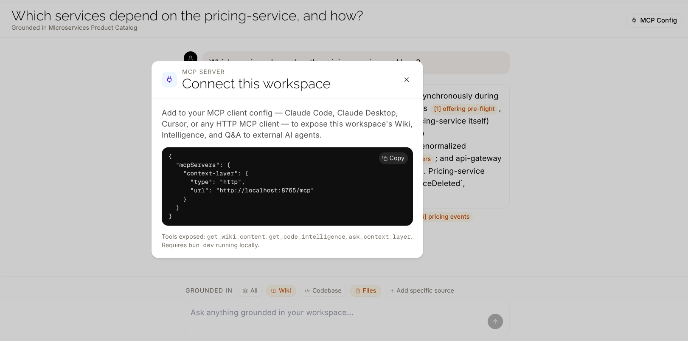

---

## 6. Generate — DocsGen

The Wiki is always current, so it always changes. Sometimes you need a document that does not change. You need to attach it to an audit, email it to a manager, or store it for a review.

DocsGen makes these fixed documents. The tabs group them by purpose:

| Tab | Content |
|---|---|
| **Structure & Architecture** | Repository maps, dependency maps, data flows, database schemas. |
| **Specification & Knowledge** | README files, requirement specifications, API documentation. |
| **Health & Risk** | Technical debt audits, security reports, test plans. |
| **Agentify** | Configuration files that make your code ready for AI agents. |
| **Institutional Memory** | Release notes and change history from your commits and reviews. |
| **Research Docs** | Documentation for scientific libraries, with links to papers. |

Each card makes one document. Click **View** to read it. Click the copy button to take the text.

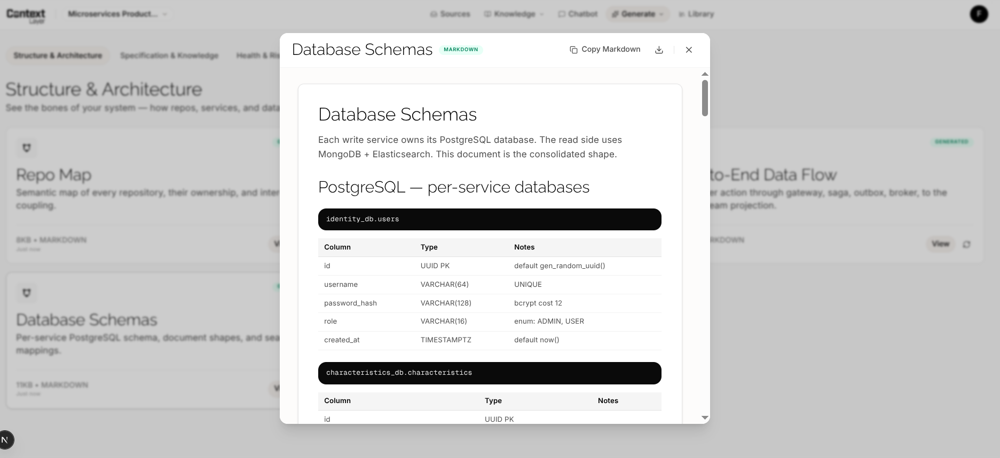

The **Agentify** tab is different from the others. It does not write documents for people. It writes configuration files for AI tools. These files tell an agent how your system is organized and which rules it must respect.

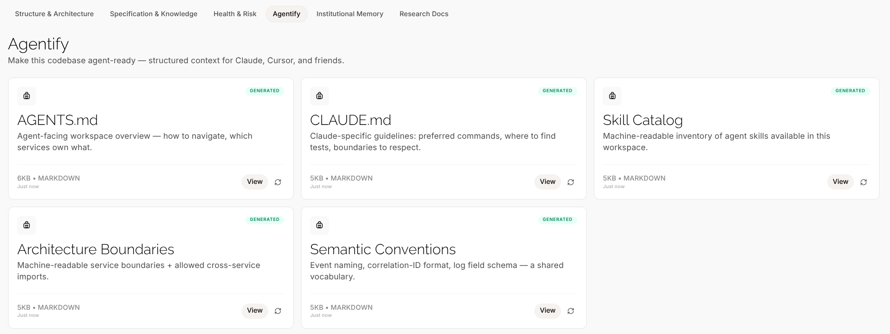

---

## 7. Generate — OmniBoard

A new developer needs weeks to understand a large system. Not everybody learns from written text.

OmniBoard makes training material in three forms. You choose the form and the depth. A chatbot helps you to plan the content first. You approve the plan. The system then builds the material in the background.

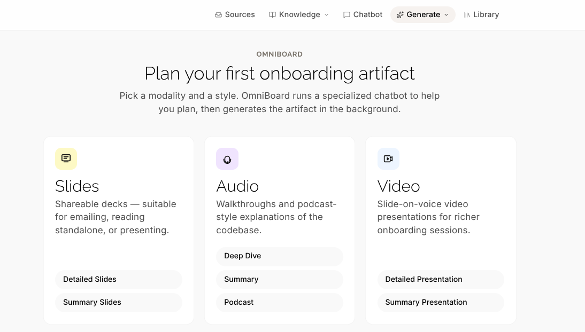

---

## 8. Library

The Library holds every item that **Generate** produced. You can search it, filter it, read an item again, download it, or build it again.

There is no screenshot of the Library on this page yet.

---

## What to Remember

1. **The knowledge is permanent.** An AI chat session forgets your system when you close it. This knowledge base does not.
2. **The knowledge covers all repositories.** Most tools read one repository. This one explains how 9 repositories work together.
3. **The knowledge stays current by itself.** The system updates after a merge, on a schedule, or when you ask.
4. **The knowledge has proof.** Every answer cites a file. Every change to the Wiki is a commit that you can inspect.
5. **The knowledge serves people and machines.** Humans use the browser. AI agents use the same data through the MCP connection.

---

## Questions

**Can I try the application myself?**
Not yet. The playground is not on a public address. These pictures are the substitute.

**Does it work with languages other than Python?**
Yes. The example uses Python. The method does not depend on the language.

**Must my code leave my network?**
No. The system is designed to run inside your own network, with your own models.

**Is the content in these pictures real?**
The interface is real software. The content is prepared example data for the demonstration. A live installation produces this content from your own code.
