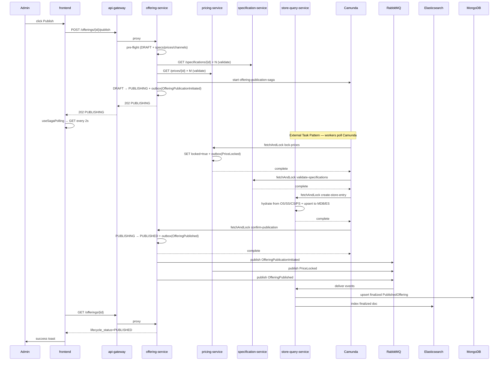

# End-to-End Data Flow — Publishing an Offering

A single concrete flow — an admin clicks Publish on a draft Offering — traced through every service it touches.

## Trigger

Admin is on `/builder`, the Offering tab. They click **Publish** on a draft offering. The `OfferingForm` fires `apiClient.post('/offerings/{id}/publish')` (through `api-gateway` on port 8000).

## Timeline

## Where the Data Lives at Each Step

| Moment | Authoritative state | Read-model state |
|---|---|---|
| DRAFT | `offerings` table in offering-service PG | N/A |
| PUBLISHING, saga in flight | offering PG (lifecycle=PUBLISHING) + outbox row + pricing PG (locked rows) | N/A (store doc is in-progress) |
| PUBLISHED | offering PG (lifecycle=PUBLISHED) | MongoDB `published_offerings` + Elasticsearch index |

## What the Customer Sees

At the moment the saga completes `create-store-entry`, a denormalized doc appears in MongoDB and is indexed in ES. The `/api/v1/store/search` endpoint can now surface the offering. In practice the customer sees the new offering 100–500 ms after the admin sees their success toast.

## Failure Compensation

If any worker fails (e.g., `validate-specifications` can't find a spec), Camunda fires compensations in reverse: `unlock-prices`, `delete-store-entry`, `revert-to-draft`. The offering returns to DRAFT with a `OfferingPublicationFailed` event; the Store doc (if one was created) is removed. The admin's polling sees `DRAFT` again and shows an error toast.
