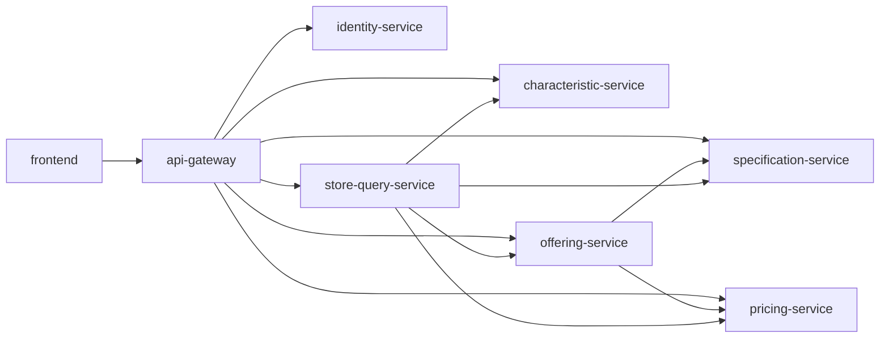
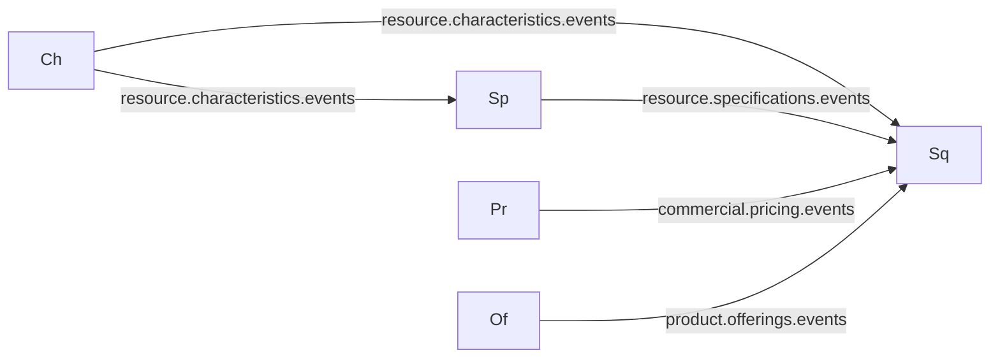

# Dependency Map

Three overlapping dependency layers: **HTTP call graph**, **event topology**, and **shared library usage**. Each layer answers a different failure-mode question.

## 1. HTTP Call Graph

Edges carry an `AsyncCircuitBreaker` with failureThreshold=3 and open-for-20s semantics. Timeouts are 2s connect and 4s read.

## 2. Event Topology

All topics are RabbitMQ topic exchanges. `store-query-service` is the universal subscriber; `specification-service` also subscribes to characteristic events to maintain its local cache.

## 3. Shared Library Usage

Every backend service imports `shared-chassis`:

- `common.logging` — JSON log format + correlation middleware
- `common.tracing` — OTLP → Zipkin
- `common.security` — JWT verification + FastAPI deps
- `common.messaging` — aio-pika wrappers
- `common.database.outbox` — `OutboxListener`
- `common.exceptions` — `AppException` hierarchy

## Failure-Mode Reading

- If **identity-service** is down: new logins fail; already-issued JWTs continue to validate because the public key is cached per-service. Dependency is cold-path after startup.
- If **characteristic-service** is down: direct writes fail; `specification-service` continues to serve reads from its cache; `store-query-service` pauses characteristic projections but already-published offerings remain queryable.
- If **offering-service** is down: no new offerings can be created or published; `store-query-service` continues serving reads.
- If **store-query-service** is down: customer Store goes dark; write side continues; events accumulate in broker queues for replay on recovery.
- If **api-gateway** is down: everything external fails. Internal tests can still hit services directly (useful for debugging, not production).
- If **shared-chassis** has a regression: all seven backend services break in the same way on the next deploy. This is why contract tests in each consumer are load-bearing.

## Outdated-Dependency Hotspots

`offering-service` ships `asyncpg 0.28.0` while every other service is on `0.29.0`. `api-gateway` is one patch behind on `common-python`. `specification-service` is two minors behind on `fastapi`. None are CVE-backed, but the `asyncpg` drift is the most likely to surface a subtle runtime difference.
