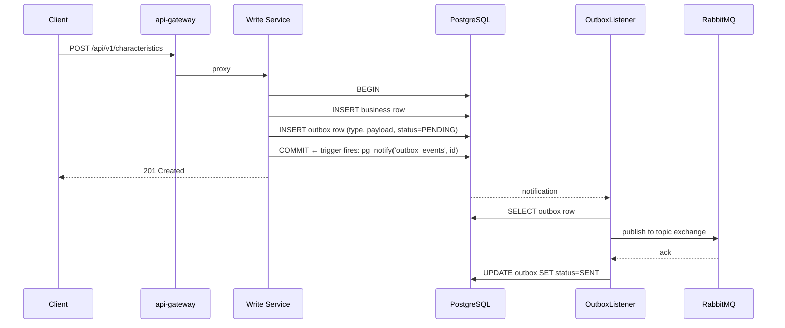
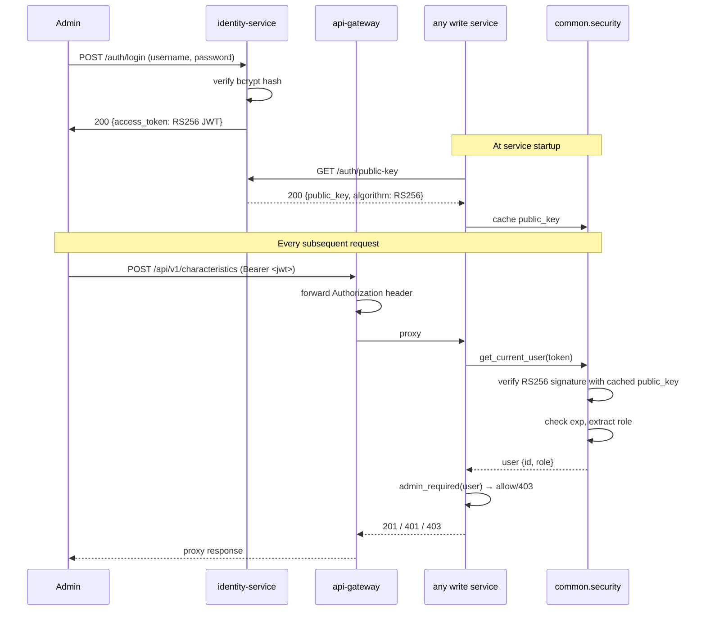

# Cross-Repo Saga Flows

The product catalog's most interesting transactions don't live inside any single service — they span four of them, plus a BPMN engine, a broker, and three databases. This page walks three flows end-to-end. Each is an argument for why you need a workspace-level view.

## Orchestration Pattern (Common to All Sagas)

The project uses **saga orchestration via Camunda BPMN** rather than choreography. The offering-service starts a Camunda process instance; individual workers in each service poll Camunda for tasks scoped to their topic, execute, and complete or fail the task. Camunda owns the workflow state machine, including compensations, visible in real time in the Camunda Cockpit.

Every step also uses the **transactional outbox** for event emission: the step writes business data + an outbox row in one PostgreSQL transaction, and a background listener publishes it to RabbitMQ.

## 1. Product Offering Publication Saga

The headline flow. Transitions a `ProductOffering` from `DRAFT` to `PUBLISHED`.

### Trigger

`POST /api/v1/offerings/{id}/publish` (admin-only). Handler: `offering/main.py:publish_offering()` → `OfferingService.initiate_publication()`.

### Participants

- **offering-service** — orchestrator; owns the lifecycle state; publishes `OfferingPublicationInitiated`, `OfferingPublished`, `OfferingPublicationFailed`.
- **pricing-service** — locks/unlocks each referenced price (`lock-prices` worker).
- **specification-service** — validates each referenced spec exists (`validate-specifications` worker).
- **store-query-service** — pre-creates the denormalized entry in MongoDB + ES (`create-store-entry` worker).
- **Camunda BPMN engine** — orchestrator runtime for `offering-publication-saga.bpmn`.

### Timeline

```mermaid
sequenceDiagram
    participant Admin
    participant OfferAPI as POST /offerings/{id}/publish
    participant OfferService as OfferingService
    participant Camunda as Camunda REST :8085
    participant PriceWorker as pricing/saga_worker.py
    participant SpecWorker as specification/saga_worker.py
    participant StoreWorker as store/saga_worker.py
    participant OfferWorker as offering/saga_worker.py
    participant Outbox as outbox table
    participant RabbitMQ as product.offerings.events

    Admin->>OfferAPI: POST /api/v1/offerings/{id}/publish
    OfferAPI->>OfferService: initiate_publication(id)
    OfferService->>OfferService: pre-flight validation (specs + prices exist, offering in DRAFT)
    OfferService->>Camunda: start offering-publication-saga with {offeringId, specIds, priceIds}
    Camunda-->>OfferService: 200 {processInstanceId}
    OfferService->>OfferService: lifecycle_status = PUBLISHING
    OfferService->>Outbox: insert OfferingPublicationInitiated
    OfferService-->>Admin: 202 Accepted {lifecycle_status: PUBLISHING}
    Outbox->>RabbitMQ: publish (via OutboxListener)

    Note over Camunda,OfferWorker: External Task Pattern — workers poll Camunda

    Camunda->>PriceWorker: fetchAndLock topic=lock-prices
    PriceWorker->>PriceWorker: SET locked=true, locked_by_saga_id=... for each price
    PriceWorker-->>Camunda: complete

    Camunda->>SpecWorker: fetchAndLock topic=validate-specifications
    SpecWorker->>SpecWorker: HTTP GET /specifications/{id} for each
    SpecWorker-->>Camunda: complete

    Camunda->>StoreWorker: fetchAndLock topic=create-store-entry
    StoreWorker->>StoreWorker: fetch offering + specs + prices; upsert to MongoDB + ES
    StoreWorker-->>Camunda: complete

    Camunda->>OfferWorker: fetchAndLock topic=confirm-publication
    OfferWorker->>OfferWorker: lifecycle_status = PUBLISHED, published_at = now()
    OfferWorker->>Outbox: insert OfferingPublished
    OfferWorker-->>Camunda: complete
    Outbox->>RabbitMQ: publish

    alt Any step fails (e.g. spec not found)
        SpecWorker->>Camunda: failTask("Spec not found")
        Camunda->>PriceWorker: compensating unlock-prices
        PriceWorker->>PriceWorker: SET locked=false for each price
        Camunda->>StoreWorker: compensating delete-store-entry
        StoreWorker->>StoreWorker: delete partial doc from MongoDB + ES
        Camunda->>OfferWorker: compensating revert-to-draft
        OfferWorker->>OfferWorker: lifecycle_status = DRAFT
        OfferWorker->>Outbox: insert OfferingPublicationFailed
        Outbox->>RabbitMQ: publish
    end
```

### What the single-repo wiki can't see

The publish handler in offering-service is ~30 lines. Everything interesting happens *outside* that file — in four other services, a BPMN definition, and a pair of queues. Tracing "what happens when I click Publish" requires holding all of it in view.

## 2. Transactional Outbox Event Publishing

Not a business saga — a *plumbing* saga that sits underneath every write. Every domain event in the system rides this rail.

### Trigger

Any write in a write service (CREATE, UPDATE, DELETE) that needs to publish an event. Example: `POST /api/v1/characteristics` creating a new characteristic.

### Participants

- **Any write service** (characteristic-, specification-, pricing-, offering-)
- **PostgreSQL** — the service's own database, holding both business tables and its `outbox` table
- **OutboxListener** — background task from `libs/common-python/src/common/database/outbox.py`
- **RabbitMQ** — destination topic exchange

### Timeline



### Compensations

There aren't any *domain* compensations — the pattern *is* the safety net. If the process dies after COMMIT but before publish, restart picks up pending rows and republishes. If RabbitMQ is down, rows accumulate with status=PENDING and flush when it recovers. The guarantee is **at-least-once**; consumers (notably `store-query-service`) are responsible for idempotency via a `processed_events` collection.

## 3. Zero-Trust Authorization Across Services

Not a saga in the Camunda sense, but a cross-cutting flow that a single-repo view misses. Every request a downstream service handles validates its JWT independently against `identity-service`'s public key — even if the request already came through `api-gateway`.

### Timeline



### Why this matters cross-repo

The identity flow has three touchpoints: `identity-service` issues; `api-gateway` forwards; every other service validates. No service trusts another. A change to the JWT schema — adding a new claim, rotating the key — is a nine-repo change. The workspace wiki is where that coordination is actually legible.

## Why Cross-Repo View Matters

Each saga above is, in isolation, well-documented inside the owning service's wiki. The *flow* is not. Single-repo wiki tools treat each repo as an island; they cannot explain that `OfferingPublished` triggers four downstream reactions in three other services, or that deleting a characteristic that's referenced by a published offering is a validation failure whose enforcement spans three services and two databases. This workspace view makes those causal chains first-class.
